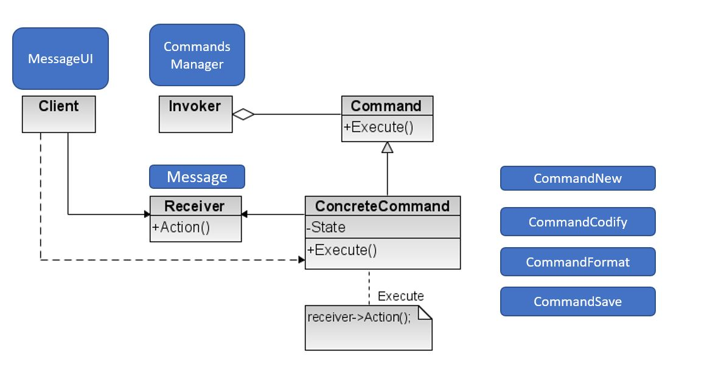

Java Patterns | Command
===

**Commnad** é um *padrão comportamental* O padrão comando permite encapsular um comando ou pedido num objecto. Assim, os clientes podem ser parametrizados com comandos variados e os comandos podem ser manipulados para atingir vários fins:
   - é possível atrasar a sua execução, colocá-los em filas de espera e registar a sua execução. 
   - é possível suportar a execução da inversão das acções das operações relativas a um comando (undo).

 *Online resource*: [Command Pattern (refactoring guru)](https://refactoring.guru/design-patterns/command)

## Aplicação

Vamos usar o padrão command para registar commandos de um menu, comandos esses que vão alterar uma Mensagem.
- É possivel
    - Criar uma "nova mensagem"
    - Formatar o texto da mensagem
    - Salvar uma Mensagem
- Também é possivel registar todos os comandos executados e escreve-los no ecran.

 Na aplicação Padrão as classes assumem os seguintes papeis do padrão command.
 
 
  - Corra o programa e verifique o funcionamento das opções 1,2,4,6 estão a funcionar corretamente
  - Repare que a classe `CommandsManager` não depende do Objecto do tipo `Message` e apenas dos Comandos que atuam sobre ele.
 
 ##Exercícios
 
 1. Crie um novo Commando - `CommandoCodify` que tem como obje4cti vo codificar uma mensagem usando as seguintes regras
      - Substitui na frase da mensagem os seguintes caracteres ("a", "?") ('i', '$') e ('e', '£')
               
2.  Faça as adaptações no UserInterface e teste.
 
3.  Acrescente na classe `Command` o método `void unExecute()`.
      - Implemente para os commandos Codify e Format a operação inversa (unExecute). Para os restantes deixes-a vazia
      - Implemente o método `undo`, que irá retirar um comando da pilha (commandsDone) e invocar o método `unExecute`.
      - Teste que é possivel executar undo dos comandos Codify e Format
 
4. Pertende-se implementar as funcionalidades de poder gravar macros de comandos e poder executa-los novamente. Para tal:
      - Defina na classe `CommandsManager` uma Lista de `Commands`
      - Implemente as operações : 
          - newMacro - inicia a lista para gravar commandos
          - playMacro - executa os comandos gravados.
          - stopMacro - para a gravação de comandos.
      - Teste estas novas funcionalidades.

5.  Implemente a operação de Undo também para o comando `ComamndNew`. 
              
